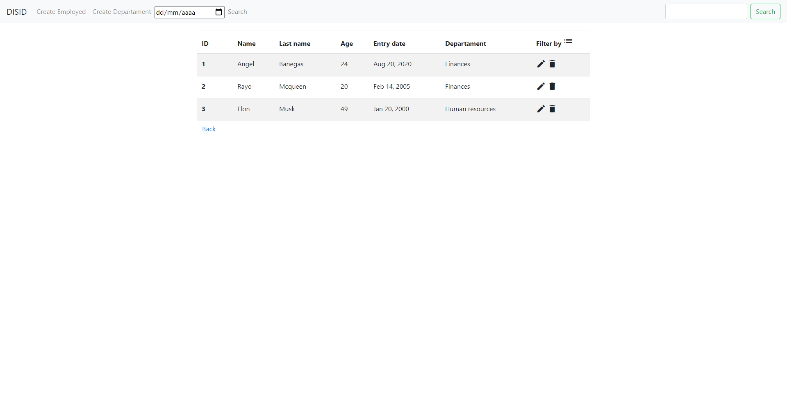

# DisidApp

This project was generated with [Angular CLI](https://github.com/angular/angular-cli) version 10.0.5.

## Development server

Run `ng serve` for a dev server. Navigate to `http://localhost:4200/`. The app will automatically reload if you change any of the source files.

## Code scaffolding

Run `ng generate component component-name` to generate a new component. You can also use `ng generate directive|pipe|service|class|guard|interface|enum|module`.

## Build

Run `ng build` to build the project. The build artifacts will be stored in the `dist/` directory. Use the `--prod` flag for a production build.

## Running unit tests

Run `ng test` to execute the unit tests via [Karma](https://karma-runner.github.io).

## Running end-to-end tests

Run `ng e2e` to execute the end-to-end tests via [Protractor](http://www.protractortest.org/).

## Further help

To get more help on the Angular CLI use `ng help` or go check out the [Angular CLI README](https://github.com/angular/angular-cli/blob/master/README.md).

## Documentacion disidApp

###### Instalaciones previas

Necesitaremos tener instalado json-server, el cual nos está simulando la base de datos

`npm install -g json-server`

Despues debemos levantar la base de datos para que los endpoints sean operativos

Con el siguiente comando la levantariamos `json-server --watch dataBase.json`

Para el resto de dependencias ya las tenemos en el package.json añadidas y solo con lanzar `npm install` nos será suficienta para descargarlas.

###### Casos de uso

A continuación vemos el home de la app

Podemos aplicar filtros

Podemos eliminar los filtros

Realizar una busqueda concreta de un empleado

Podemos añadir un empleado

Podemos añadir un departamento

Confirmamos que queremos eliminar un empleado

Editamos un empleado seleccionado con sus datos precargados

## Estructura y flujo de datos

La app se compone de 4 componentes -> Los cuales se comunican através de outpus-inputs y localStorage (comunicacion child-child)
